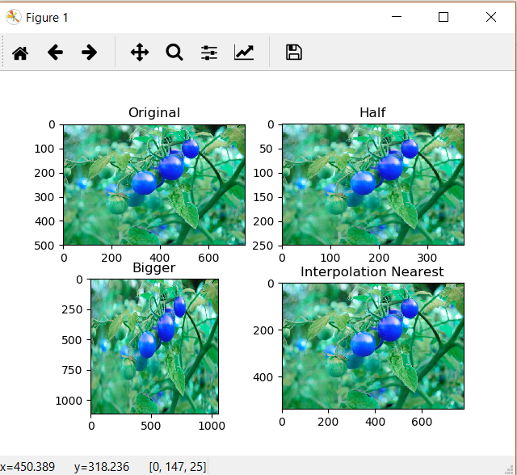
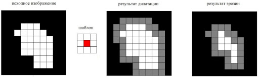
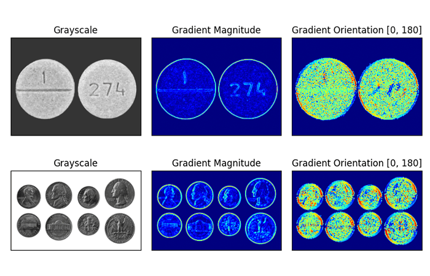

# CV_Lab2
Вдохновлено курсами Joseph Redmond

Изменение разрешения и интеполяция

# Изменение разрешения изображения

[Пример использования](https://www.geeksforgeeks.org/image-resizing-using-opencv-python/)

    cv2.resize(source, dsize, dest, fx, fy, interpolation)

Source: матрица - изображение\
dsize: размер выходной матрицы\
dest[опционально]: выходная матрица\
fx: коэффициент сжатия горизонтальный\
fy: коэффициент сжатия вертикальный\
interpolation: Один из методов интерполяции\

cv2.INTER_AREA: This is used when we need to shrink an image.
cv2.INTER_CUBIC: This is slow but more efficient.
cv2.INTER_LINEAR: This is primarily used when zooming is required. This is the default interpolation technique in OpenCV.

# Фильтрация на основе сверток
Самыми простыми методами фильтрации изображения, можно назвать свертки. Мы их накладываем на изображение
## Создание коробочного фильтра

[Пример](https://www.geeksforgeeks.org/python-opencv-filter2d-function/)

    kernel1 = np.ones((5, 5), np.float32)/30
    img = cv2.filter2D(src=image, ddepth=-1, kernel=kernel1)

## Создание сверточной функции

[Пример](https://learnopencv.com/image-filtering-using-convolution-in-opencv/)    

## Реализация ядра Гауса 

    
    GaussianBlur(src, dst, ksize, sigmaX)
    
    medianBlur(src, ksize)

    bilateralFilter(src, d, sigmaColor, sigmaSpace)
    
# Фильтры Собеля

[Пример](https://pyimagesearch.com/2021/05/12/image-gradients-with-opencv-sobel-and-scharr/)
