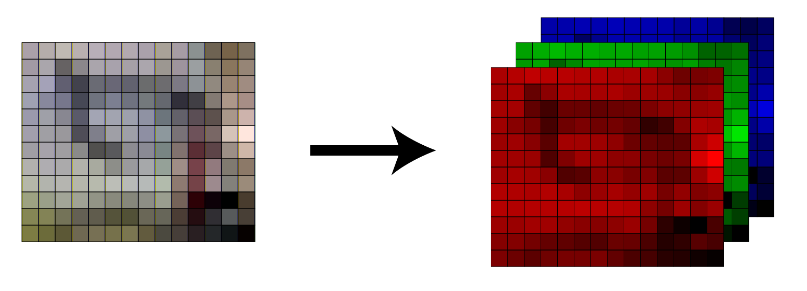
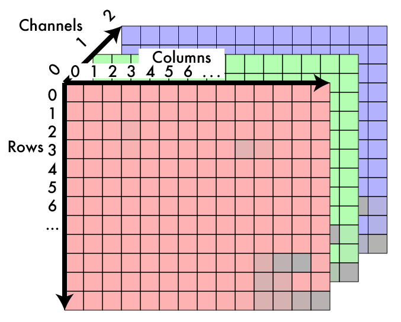
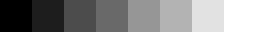

#Tasks
# Get and set pixels of image
Что из себя представляет изображение.
Это матрица по ширине и высоте изображения в пикселях и глубиной в 3.

Можно представить схемотично в виде

[Пример работы](https://pyimagesearch.com/2021/01/20/opencv-getting-and-setting-pixels/)

Возьмем любое изображение из папки и попробуем получить его цифровое представление.
    
    image[100,100]
После чего попробуем его изменить по пиксельно.
    
    image[100,100] = [255, 255, 255]
# Copying images
Понятно, что можно работать с базовыми понятиями OS, и использовать их. Но можно и работать с openCV
    
    imwrite("test.png", image)

# Grayscale image
Длины волн, которые может видеть глаз человека

Обычная линейка цветов при переводе в черно-белое изображние 

    
    K=(R+G+B)/3

Но интуитивный формат не очень читаем и понятен 

    Y' = 0.299 R' + 0.587 G' + .114 B'

# Shifting the image colours

# Clamping the image values

# RGB to Hue, Saturation, Value

# HSV to RGB

# Change Saturation